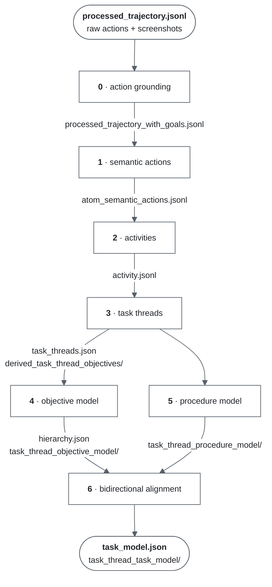

<p align="center">
  
  &nbsp;&nbsp;&nbsp;&nbsp;
  <a href="https://nlp.stanford.edu/"></a>
</p>

<h1 align="center">Inducing Task Models from Computer-Use Traces</h1>

<p align="center">
  <a href="https://arxiv.org/abs/2608.20319"></a>
  <a href="LICENSE"></a>
  
  
</p>

---

A recorded computer-use session contains thousands of low-level clicks and
keystrokes, but no explicit record of the work they accomplished. This
repository recovers that structure. It takes a recording of real work and
induces a **task model**: a hierarchy of objectives paired with a control-flow
procedure (`SEQ`, `FOR`, `WHILE`, `CHOICE`), in which every node is grounded in
the specific actions that support it.

This repository is the reference implementation of [**Inducing Task Models from
Computer-Use Traces**](https://arxiv.org/abs/2608.20319) (EMNLP 2026). The
pipeline documentation maps each stage to the section of the paper that
motivates it:
[`task_model_induction/README.md`](task_model_induction/README.md).

## Components

| | Description | Location |
|---|---|---|
| **Recorder** | A macOS application that captures clicks, keystrokes, and screenshots into a session directory. Distributed as a signed `.dmg`, and runnable from the command line (tested on Apple Silicon). | [`computer-recorder/`](computer-recorder/) |
| **Pipeline** | Seven stages that lift a raw trajectory into a grounded task model. | [`task_model_induction/`](task_model_induction/) |
| **Visualizer** | A local web application for inspecting the result, presenting trace, objectives, and procedure side by side. | [`frontend_visualizer/`](frontend_visualizer/) |

Stage 0 of the pipeline depends on a fourth component, the [**action grounding
service**](task_model_induction/action_grounding_service/): a Dockerized
OCR + OmniParser + VLM service that converts a screenshot and a raw click into a
description of the operation performed.

## Quickstart

**1. Record a session.** Open the prebuilt recorder,
[`computer-recorder/ComputerRecorder-1.0.1-arm64.dmg`](computer-recorder/ComputerRecorder-1.0.1-arm64.dmg)
(macOS on Apple Silicon only), drag it to `/Applications`, grant Accessibility
and Screen Recording, and begin recording. On stop, the recorder consolidates
the capture into `processed_trajectory.jsonl` and archives the session to
`~/Downloads/recorder_sessions/<session>.zip`. Extract the archive to obtain the
session directory the pipeline reads.

> [!WARNING]
> The recorder captures screenshots of everything on screen. Sessions remain
> local and are never uploaded, but they are as sensitive as the work they
> capture. Review a session before sharing it, and keep `recorder_sessions/`
> out of version control — this repository's `.gitignore` already excludes it.

To record without installing the application, run `pip install -e
computer-recorder` and then `python3 computer-recorder/record.py`. This drives
the same capture backend and produces the same session. Both paths, and
instructions for building the application from source, are documented in
[`computer-recorder/README.md`](computer-recorder/README.md).

**2. Configure credentials.**

```bash
cp .env.example .env   # then fill in OPENAI_API_KEY
```

**3. Start the grounding service.**

```bash
cd task_model_induction && uv run action-grounding-service init
```

This starts the API on `localhost:8000` and OmniParser on `localhost:8080`. The
first run downloads model weights and may take several minutes. For complete
setup instructions, see
[`action_grounding_service/README.md`](task_model_induction/action_grounding_service/README.md).

**4. Run the pipeline.** Provide the path to the session directory. Any location
is acceptable, provided it contains `processed_trajectory.jsonl`.

```bash
scripts/run_pipeline.sh <path/to/session>
```

To validate inputs and model access without issuing any model calls:

```bash
scripts/run_pipeline.sh <path/to/session> --preflight
```

Each stage writes into the session directory and caches its output, so a re-run
resumes rather than restarts. Use `--from 3` to resume from a specific stage.

**5. Inspect the result.**

```bash
cd frontend_visualizer && npm install && npm run dev
```

Open `localhost:3000` and specify the session directory.

## Pipeline

Each stage reads the preceding stage's output from the session directory and
writes its own alongside it.



Stages 4 and 5 produce two independent readings of the same work: the objective
that motivated it, and the control flow that organized its execution. Stage 6
reconciles the two, so that every objective node carries a control-flow
annotation and every procedure step references the activities that evidence it.

Because naturalistic sessions interleave concurrent work, stage 3 first
separates the trace into task threads; stages 4–6 then run per thread.

## Configuration

Model selection, batch sizes, concurrency, and caching are configured in
[`task_model_induction/config.yaml`](task_model_induction/config.yaml). The
default configuration routes every stage through OpenAI, so `OPENAI_API_KEY` is
the only credential required.

Each stage accepts a LiteLLM parameter block, so any LiteLLM-compatible provider
is supported. To use a different provider, copy `config.yaml`, edit the `model`
and credential fields, and pass the copy:

```bash
scripts/run_pipeline.sh <path/to/session> --config task_model_induction/my-config.yaml
```

Token usage and cost are metered per stage and written to `*.cost.json`
alongside each output.

## Requirements

- macOS for the recorder, tested on Apple Silicon; the pipeline and visualizer run on any platform
- Python 3.11+ and [uv](https://docs.astral.sh/uv/)
- Docker, required by the grounding service and by the sandboxed agent runner used in stages 4–6
- Node.js 18+, for the visualizer and for building the recorder UI

## Repository layout

```
computer-recorder/          macOS recorder
  crec/                       capture engine (input hooks, screen capture)
  recorder-ui/                Electron app, packaged as the .dmg
  record.py                   command-line front end (no app install)
task_model_induction/       induction pipeline
  step0..step6                pipeline stages
  schemas/                    pydantic schemas for every stage output
  action_grounding_service/   Dockerized grounding API (stage 0's dependency)
  codex_cli_sandbox/          sandboxed agent runner used by stages 4–6
  tests/
frontend_visualizer/        Next.js viewer for induced task models
scripts/run_pipeline.sh     run one session through the pipeline
```

## Citation

```bibtex
@misc{jiang2026inducingtaskmodelscomputeruse,
      title={Inducing Task Models from Computer-Use Traces},
      author={Yucheng Jiang and Zora Zhiruo Wang and Ruishi Chen and Diyi Yang},
      year={2026},
      eprint={2608.20319},
      archivePrefix={arXiv},
      primaryClass={cs.CL},
      url={https://arxiv.org/abs/2608.20319},
}
```

## License

[Apache 2.0](LICENSE).
