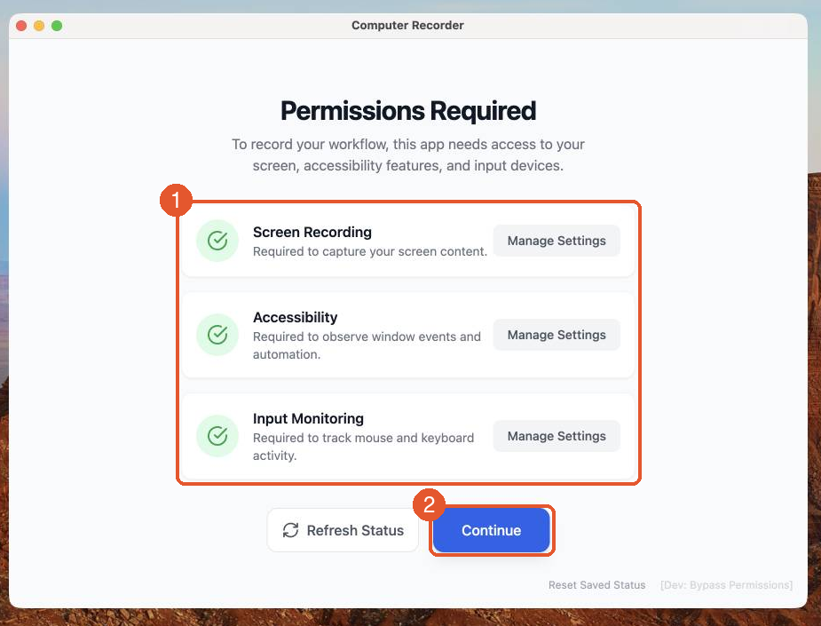
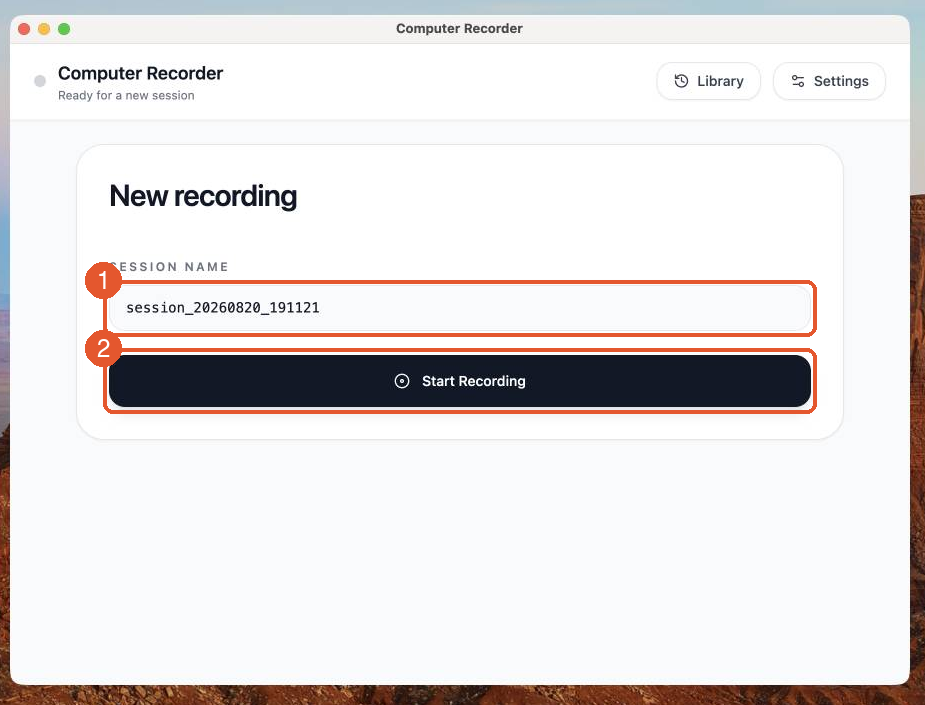
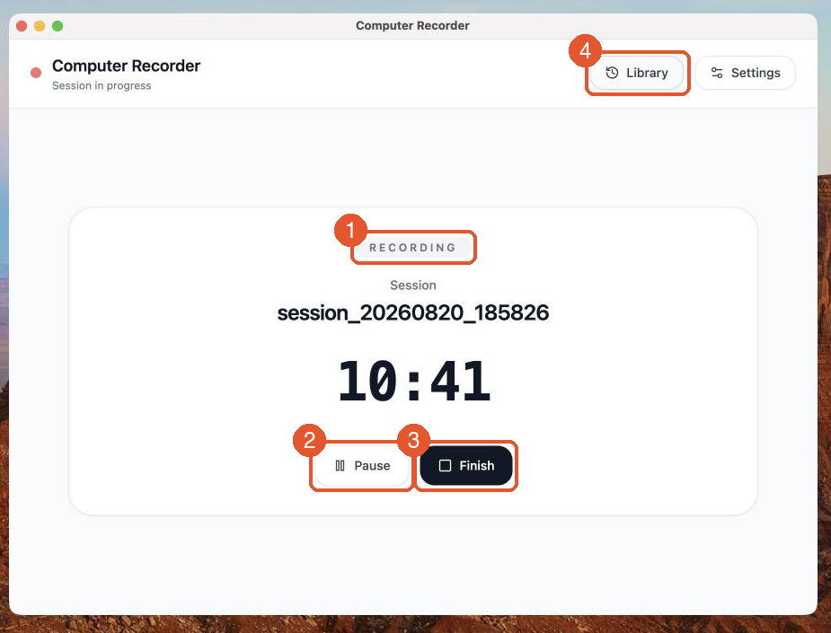
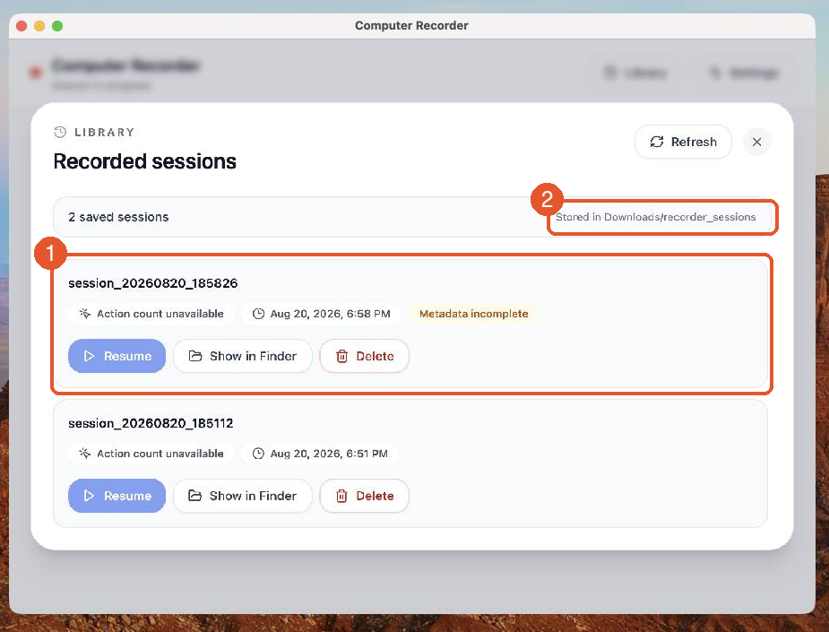

# Computer Recorder — Walkthrough

A visual tour of the macOS recorder app, from install to your first recorded
session. **Apple Silicon Macs only.**

## 1. Install

Open [`ComputerRecorder-1.0.1-arm64.dmg`](ComputerRecorder-1.0.1-arm64.dmg) and
drag **ComputerRecorder** into `/Applications`.

> **First launch on a downloaded copy:** the app is signed but not notarized,
> so macOS will refuse a plain double-click ("Apple could not verify…").
> Right-click the app → **Open** → **Open**, or approve it under
> **System Settings → Privacy & Security → Open Anyway**. You only need to do
> this once. If you'd rather not run an unnotarized binary,
> [build it from source](recorder-ui/README.md) — signing with your own
> Developer ID makes the warning go away.

## 2. Grant permissions

On launch the app checks the three macOS permissions it needs. Nothing is
recorded until you explicitly start a session — these grants just make
recording possible.



1. **The three permissions.** Screen Recording (to capture screenshots),
   Accessibility (to observe window events), and Input Monitoring (to see
   mouse and keyboard activity). Each row shows a green check once granted;
   **Manage Settings** deep-links to the right System Settings pane. After
   toggling a permission in System Settings, come back and hit
   **Refresh Status**.
2. **Continue** becomes useful once all three are green.

## 3. Start a recording



1. **Session name.** Pre-filled with a timestamp; rename it if you want
   something meaningful (`expense_report_run1`).
2. **Start Recording.** From this moment every click and keystroke is
   captured, with a screenshot just before and just after each action.

## 4. While recording

The app stays out of your way — do your normal work in any application.



1. **Status badge and timer** show the session is live.
2. **Pause** suspends capture (the badge turns to PAUSED and the dot goes
   orange); **Resume** picks the same session back up. Use this to skip
   anything you don't want in the trace.
3. **Finish** stops the session and kicks off post-processing —
   consolidating the raw event stream into a processed trajectory. This takes
   a moment for long sessions; wait for the green **Saved** check.
4. **Library** is available mid-session too, showing previously recorded
   sessions.

## 5. Browse your sessions



1. **Each saved session** gets a row with **Resume** (continue recording into
   the same session), **Show in Finder**, and **Delete**.
2. Sessions are stored under **`~/Downloads/recorder_sessions/`** — one zip
   per session, nothing leaves your machine.

## 6. What a session contains

Each finished session is written to
`~/Downloads/recorder_sessions/<session_name>.zip`:

```
<session_name>/
  processed_trajectory.jsonl    one action per line, with before/after state
  processed_trajectory.json     the same actions plus OCR/VLM enrichment
  raw_trace.jsonl               the raw event stream
  screenshots/                  before/after JPEG per action + bounding_boxes.jsonl
  annotated_screenshots/        same frames with the click position marked
```

Every action row carries the action (e.g. `click_left(x, y)`), paths to the
screenshots bracketing it, and timestamps. `processed_trajectory.jsonl` is the
file the [induction pipeline](../task_model_induction/) lifts into a task model.

A recorded session is exactly as sensitive as the work it captured — skim the
screenshots before sharing one.
