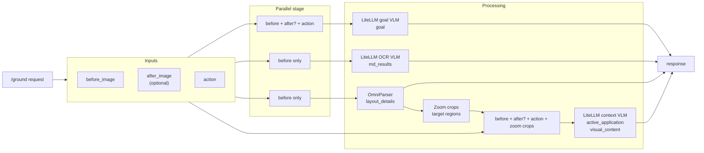

# Action Grounding Service

A Dockerized API that answers one question: given a screenshot and a raw action
such as `click(100, 200)`, what was on screen and what was the user doing?

[Stage 0](../README.md) of the pipeline calls this service for every recorded
action. Nothing else in the pipeline needs it, but stage 0 cannot run without it.

Inside, three things run per request:

| Component | What it does | How it runs |
|---|---|---|
| **OCR** | Extracts the screen as Markdown | LiteLLM-compatible vision model (your API key) |
| **OmniParser** | Detects UI elements and their boxes | Second container, started for you |
| **VLM grounding** | Infers `goal`, `active_application`, `visual_content` | LiteLLM-compatible vision model (your API key) |

---

# Setup

Work through steps 1–5 in order. Every command runs from `task_model_induction/`,
the directory holding `pyproject.toml` and `config.yaml`.

```bash
cd task_model_induction
```

## Step 1 — Check the prerequisites

- **Docker** running (Docker Desktop is fine). `docker version` should succeed.
- **[uv](https://docs.astral.sh/uv/)** installed.
- Roughly 10 GB of free disk for the OmniParser image and weights.

## Step 2 — Put your API key in `.env`

The service reads the repo-root `.env` file. If you have not created it yet:

```bash
cp ../.env.example ../.env
```

Then open `../.env` and fill in your key:

```bash
OPENAI_API_KEY=sk-...
```

## Step 3 — Choose the models in `config.yaml`

The service reads the `action_grounding_service:` section of
[`config.yaml`](../config.yaml). The shipped defaults work as-is with an
`OPENAI_API_KEY`, so **you can skip this step on a first run**:

```yaml
dotenv_path: ".env"          # top level, shared with the pipeline

action_grounding_service:
  max_concurrent_requests: 32
  ocr:
    model: openai/gpt-5.4-mini
    api_key: os.environ/OPENAI_API_KEY
    timeout_secs: 120
    max_tokens: 16384
  vlm:
    model: openai/gpt-5.4-mini
    api_key: os.environ/OPENAI_API_KEY
    timeout_secs: 120
    max_tokens: 16384
  omniparser:
    max_concurrent_requests: 2
    timeout_secs: 180
    box_threshold: 0.05
    iou_threshold: 0.1
    imgsz: 640
```

Change the `model` lines here if you want different models. To point at a
different provider entirely, see
[Using another provider](#using-another-provider) below.

## Step 4 — Start the service

```bash
uv run action-grounding-service init
```

This builds both images if needed, starts both containers, and waits for their
health checks. The first run downloads OmniParser weights — allow a few minutes.

When it finishes you have:

- `action-grounding-service` on `http://localhost:8000`
- `action-grounding-omniparser` on `http://localhost:8080`

## Step 5 — Verify it works

```bash
curl http://localhost:8000/health
curl http://localhost:8000/config
curl -X POST http://localhost:8000/config/check
```

`/config/check` calls the OCR model, the grounding VLM, and OmniParser with a
tiny probe and reports `ok` for each. If a model reports an error here, your key
or `model` string in step 3 is wrong — fix it and re-run
`uv run action-grounding-service init --rebuild`.

That is the whole setup. Stage 0 of the pipeline picks the service up from
`action_grounding_stage.grounding_url` in `config.yaml`, which already points at
`http://localhost:8000`.

---

# Reference

## Configuration reference

`ocr` and `vlm` take the same fields:

| Field | Meaning |
|---|---|
| `model` | LiteLLM model string, e.g. `openai/gpt-5.4-mini` |
| `timeout_secs` | Per-request timeout |
| `max_tokens` | Response token cap |
| `api_key` | Key value, or `os.environ/NAME` to read it from the environment |
| `api_base` / `base_url` | Endpoint override, or `os.environ/NAME` |
| `api_version` | Version string for providers that need one, or `os.environ/NAME` |
| `env` | Literal environment variables to export before calling the model |
| `completion_kwargs` | Extra kwargs passed straight through to LiteLLM |

`api_key_env`, `api_base_env`, `api_version_env`, and `base_url_env` are the
older form of the `os.environ/NAME` syntax and still work.

`dotenv_path` is a **top-level** key in `config.yaml`, not part of the
`action_grounding_service` section — it is shared with the pipeline.

## Using another provider

Any LiteLLM-compatible endpoint works. Set the model string and whatever
variables that provider reads. A self-hosted OpenAI-compatible server, for
example:

```yaml
action_grounding_service:
  ocr:
    model: openai/qwen3-vl-32b-thinking
    timeout_secs: 120
    max_tokens: 16384
    base_url: "http://example-host:18365/v1"
    api_key: os.environ/OPENAI_API_KEY
```

You can also keep endpoint values in `.env` and reference the standard provider
names:

```bash
OPENAI_API_BASE=http://your-inference-host:18365/v1
OPENAI_API_KEY=...
```

After changing `config.yaml`, restart the service so it reloads:

```bash
uv run action-grounding-service stop
uv run action-grounding-service init
```

## Lifecycle commands

```bash
uv run action-grounding-service init      # build if needed, start, wait for health
uv run action-grounding-service status    # container + health check
uv run action-grounding-service stop      # stop and remove containers
```

`init` reuses already-running containers. Use `--rebuild` after changing service
code or dependencies:

```bash
uv run action-grounding-service init --rebuild
```

The service Dockerfile installs dependencies in a separate cached layer, so
code-only rebuilds reuse it. OmniParser weights are cached in the Docker volume
`action-grounding-omniparser-weights` and survive rebuilds.

## API

Ground one action:

```bash
curl -X POST "http://localhost:8000/ground" \
  -H "Content-Type: application/json" \
  --data @request.json
```

```json
{
  "before_image": "data:image/jpeg;base64,...",
  "after_image": null,
  "action": "click(100, 200)",
  "screen_size": {
    "width": 1212,
    "height": 758
  }
}
```

Other endpoints:

| Endpoint | Purpose |
|---|---|
| `GET /health` | Liveness |
| `GET /health/details` | Liveness plus OmniParser reachability |
| `GET /config` | Effective config, secrets redacted |
| `PUT /config` | Write a new config to `config.yaml` |
| `POST /config/check` | Probe OCR, VLM, and OmniParser |
| `POST /ocr` | OCR a single image |
| `POST /ground` | Full grounding pipeline |

## Request flow



## Running Docker by hand

`uv run action-grounding-service init` is the supported path. If you need to
drive Docker directly:

```bash
docker build -f action_grounding_service/Dockerfile -t action-grounding-service .

docker run --rm -p 8000:8000 \
  --env-file .env \
  -e ACTION_GROUNDING_CONFIG=/app/config.yaml \
  -v "$PWD/config.yaml:/app/config.yaml" \
  action-grounding-service

docker run --rm -p 8080:8080 \
  --name action-grounding-omniparser \
  --network action-grounding-net \
  -v action-grounding-omniparser-weights:/weights \
  action-grounding-omniparser
```

`ACTION_GROUNDING_CONFIG` selects the config path inside the container, so a
config file under any name works as long as you mount it there.
